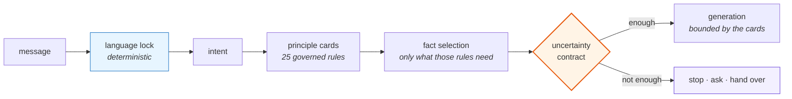

# Claude Code, configured — and the agent it produced

**Part I** is what I load into Claude Code before I build anything: the code
graph, the critic subagents, the harness, and the three memory layers that keep
knowledge from evaporating between sessions.

**Part II** is the system I built with it — an AI administrator handling the
inbound flow for a manufacturer in Québec with a catalogue in the hundreds. Not
a scripted bot. A reasoning stack.

For engineers building agents with Claude Code. It assumes you already know what
a harness is and skips the explanation.

---

## What was actually built

Two things, and they are the reason the rest of this repository exists.

### A reasoning stack, not a decision tree

Six layers between an incoming message and a sent answer, ordered so that **the
cheapest and most deterministic checks run first.** By the time a model is
involved, the language is fixed, the intent is known, and the set of admissible
facts has already been narrowed.

The core is **25 principle cards**, each a small governed rule with twelve
fields. Four of them do the work no rule set does:

- **`forbidden_action`** — what may never be done under this rule, carried next
  to the permission. Present on all 25.
- **`uncertainty_rule`** — what to do when the inputs are insufficient, **per
  card, not globally**. 24 distinct values across 25 cards: a missing input means
  something different for a warranty question than for a stock question.
- **`known_facts`** — the facts this rule depends on, declared, so the system can
  rank what is missing instead of listing it.
- **`exceptions`** — where the rule does not hold.

**[Read the reasoning stack →](docs/part2/03-reasoning-stack.md)**

### A memory that stays correct while the catalogue moves

Products are discontinued, specifications are corrected, the website is edited by
someone who does not know an agent reads it. An agent whose knowledge is a
snapshot is right on the day it ships and degrades from then on — invisibly,
because a stale answer looks exactly like a fresh one.

Four mechanisms hold it together:

| | |
|---|---|
| **Three states, not two** | Active, **stale**, absent. Collapsing the middle one makes the agent either deny products that exist or sell products that do not |
| **The review filter lives in SQL** | Not in the calling code. An unapproved page is *unreachable* — there is no code path that returns it, because there is no code path that selects it |
| **Any error halts reconciliation entirely** | A partial crawl reporting nineteen missing products is indistinguishable from nineteen discontinued ones. Nothing is ever deleted; rows are marked |
| **Human review before a learned item goes live** | An agent that writes its own durable knowledge without review is not more mature — it is a system whose wrong entries reinforce themselves |

**[Read the memory architecture →](docs/part2/05-memory-and-updates.md)**

---

## And it was measured

Rare enough to state plainly: this system has been measured, against a frozen set
of real questions, by judges that did not produce the answers.

**121 real questions**, frozen, replayed against the release in production. Four
independent judges, each with fresh context, none of whom saw the answering run.
**62.8 % of conversations resolved on the first turn with no human involved** —
and, in the same run, the weakest category exposed at 8.7 %, which no overall
average would have shown.

One run, a model judge, no baseline. **A reference point, not a verdict** — and
the document says so.

**[09 · What the measurement found →](docs/part2/09-what-the-measurement-found.md)**
— the numbers, three dated incidents with line numbers, and what they do not
prove.

---

## Part I · The configured assistant

What is actually installed, why each piece is there, and what I rejected.

| # | Document | |
|---|---|---|
| 1 | [What is loaded, and why](docs/part1/01-what-is-loaded.md) | The full inventory: MCP code graph, plugins, skills, four hook points, the gated pipeline, three memory layers |
| 2 | [The context economy](docs/part1/02-context-economy.md) | Three loading tiers and the placement rule. Where a rule goes and what it costs to keep it there |
| 3 | [Memory architecture](docs/part1/03-memory-architecture.md) | Intake → adjudication → wiki → index → append-only log. Why refusal is the primary output |
| 4 | [The adjudication skill](docs/part1/04-adjudication-skill.md) | The complete working skill, not a description of one |
| 5 | [Gates](docs/part1/05-gates.md) | Reversible versus not. Where a real control lives, and where a gate is theatre |
| 6 | [How I know it works](docs/part1/06-how-i-know-it-works.md) | Observable criteria fixed in advance — and what I have not measured |
| 7 | [Installation order](docs/part1/07-installation-order.md) | Five stages. The first is a week of doing nothing, on purpose |
| 8 | [Before you build an agent](docs/part1/08-before-you-build.md) | Nine questions I answer before writing the first line of one — and before adding a second |

## Part II · The AI administrator

An anonymized architecture study. No client name, no product names, no prompts
reproduced verbatim — structure and intent in full, wording replaced with a
neutral example.

| # | Document | |
|---|---|---|
| 1 | [The problem](docs/part2/01-the-problem.md) | The inbound flow, its shape, and what it costs when a human absorbs it |
| 2 | [Why a scripted bot fails here](docs/part2/02-why-scripts-fail.md) | Four classes of real message that break every decision tree |
| 3 | [The reasoning stack](docs/part2/03-reasoning-stack.md) | Layer by layer: language lock, intent, principle cards, fact selection, sufficiency check, escalation |
| 4 | [Product knowledge](docs/part2/04-product-knowledge.md) | How facts are stored, retrieved, reviewed and activated — and why the filter lives in SQL |
| 5 | [Memory that stays oriented](docs/part2/05-memory-and-updates.md) | How the knowledge base updates itself and how the agent stays correct while it does |
| 6 | [Limits and handoff](docs/part2/06-limits-and-handoff.md) | When the system must stop, and why admitting ignorance is worth paying for |
| 7 | [Catching a bad answer](docs/part2/07-catching-bad-answers.md) | What is recorded per exchange, what raises an alarm, how a failure is dissected |
| 8 | [What is deliberately absent](docs/part2/08-deliberately-absent.md) | Rejected designs, with reasons |
| 9 | [What the measurement found](docs/part2/09-what-the-measurement-found.md) | **The numbers, three dated incidents, and what they do not prove** |

## Also here

- **[Decision log](decisions/README.md)** — every architectural choice with the
  options that lost and why.
- **[Templates](templates/)** — the instruction file, wiki page, index, log,
  adjudication skill and decision record. Copy them.

---

## One thing that runs through both parts

> Telling a model not to do something is a request. It is not a control.

In Part I this is why the permission and gate design looks the way it does. In
Part II it is why the review filter on the knowledge base sits inside the SQL
query rather than in the prompt — so that no caller can bypass it, including a
future version of the code written by someone who has forgotten the rule.

The same sentence produced both designs. That is most of what this repository is
about.

---

## What is not here

No controlled comparison of this setup against no setup. I have a decision log,
production behaviour, and criteria fixed in advance — not an experiment. Where a
number appears, its source is stated. Where I have not measured something, it
says so.

No client name, no product names, no credentials, no customer data in any form,
including anonymized samples.

---

## If you only do one thing

Everything above compresses to one sentence: **a control has to be something the
system cannot decline.** Not a rule in a prompt, not a habit, not a note in a
file everyone stopped reading in week three. Code, a flag, or a test.

I spent a long time believing the well-worded version was enough. It held every
time until the input got strange, and then it did not, and nothing raised an
alarm — which is the part that costs you.

If you take one thing from this repository, take the smallest one.

**Freeze twenty real questions this week.** Not invented ones — twenty your
system actually received. Run them. Then have something that did not produce the
answers grade the answers: another model with a clean context, a colleague,
anyone who was not in the room.

You will not enjoy the number. That is the whole value of it. Mine said 62.8 %,
and the useful part was not the 62.8 — it was finding out that the question
customers ask right before they buy was failing nine times out of ten, hidden
comfortably inside an average that looked like progress.

Twenty questions and one honest grader is a Tuesday afternoon. It will tell you
more about your system than another month of building on top of it.

---

I am still missing things, and they are named rather than hidden: no controlled
comparison against no setup, no deny-list in my own permission configuration, and
no multi-agent system I have actually built — I argue about when a second agent
is justified, and an argument is not a practice.

If something here is wrong, I would genuinely rather know. The decision log
exists so a bad call can be found and reversed, and that only works if somebody
looks.

**[nova@lavrikgeo.com](mailto:nova@lavrikgeo.com)** · [lavrikgeo.com](https://lavrikgeo.com)

## Licence

[MIT](LICENSE).
