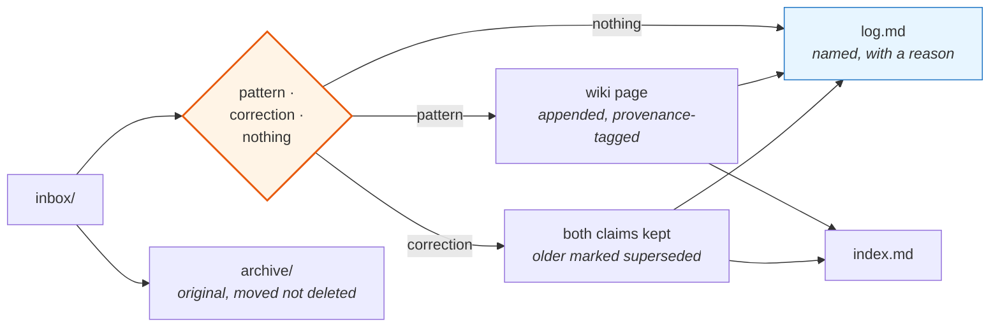

# 04 · The adjudication skill

This is the mechanism that turns collected material into knowledge, and — more
often — refuses it. Below is the working skill, not a description of one.

Its job is narrow on purpose: read what arrived, decide what it is, write the
survivors into the wiki, and record every verdict including the refusals.

---

## Why it is a skill and not an instruction

Three properties that an instruction in the always-loaded file cannot give it.

**It costs nothing when idle.** Only the description sits in context. The
procedure below — roughly 900 words — loads when the skill runs and is absent
the rest of the time.

**It cannot start on its own.** The skill declares `disable-model-invocation:
true`. It moves files and edits durable pages, so it runs when asked and never on
its own initiative. This is the difference between a tool and a process that
quietly rearranges your knowledge base while you are thinking about something
else.

**It is auditable.** The procedure is a file. When the intake starts producing
bad judgments, there is a specific text to fix, and the fix applies from the next
run — no retraining, no prompt archaeology.

---

## The skill

<details>
<summary><b>Full source — click to expand</b></summary>

```markdown
---
name: learn
description: Process material collected in knowledge/inbox and fold what is
  worth keeping into the wiki. Adjudicate each item, reject most of it out loud,
  and record every verdict.
disable-model-invocation: true
---

# /learn

Material arrives in `knowledge/inbox` — articles, exports, transcripts, and URLs
in `inbox/links.md`. This turns some of it into knowledge and refuses the rest.

## For each item

### 1 · Read it, then classify honestly

- **A working pattern** — someone ran this in production and said how,
  including what constrains it.
- **A useful correction** — it contradicts something already in the wiki.
- **Nothing** — a rehash, a listicle, vendor material, or already covered.

### 2 · If it is nothing, say so and add nothing

Name the file and give one line of reason. Out loud, in the report, not
silently.

A knowledge base that accepts everything is a landfill, and a landfill is worse
than an empty folder because it looks like an asset. Rejecting is the main work,
not a failure.

### 3 · If it is worth keeping, write it into the wiki

Prefer appending to an existing page over creating a new one. Few thick pages
beat many thin ones: related constraints that live apart contradict each other
silently.

Keep only what is actionable — the pattern, the constraints that make it safe,
recoverable and observable, and where it does not apply. Not a summary of the
article. Two paragraphs is usually enough.

Every entry carries:

    source:      author + where published
    as_of:       the date of the material, not today
    source_type: primary | secondary

Secondary material never settles a decision on its own.

If a claim contradicts an existing page, do not silently overwrite. Keep both,
mark the older one superseded, and state which won and why.

### 4 · Move the original to archive/

Moved, never deleted. A disputed claim has to be traceable to its source.

### 5 · Update index.md

One line per page, grouped by the question it answers, with the date.

## Report back — always these three columns

| Material | Verdict | Where |

Then one line per rejected item saying why. Then the page count. Nothing else.

Append one row per item to `knowledge/log.md`. Never rewrite that file.

## Say when knowledge is used

When a wiki page shapes a decision during ordinary work, name it in one line:
`from wiki/<page>`. If the repository contradicts a page, the repository wins.
Say so, and fix the page in the same breath.
```

</details>

---

## The three parts that do the work

### The three-way classification

Most intake systems have two outcomes: keep or ignore. Ignoring is silent, so
nothing is learned from it and the same material returns next quarter.

Here the third outcome is **an output**: named, with a reason, written to the log.
Roughly two-thirds of good material ends there. A recent run of three articles
produced one full pattern, one single idea worth keeping, and one complete
refusal — and the refusal was recorded with the sentence *"a listicle with star
counts, no measurements, and not a single case where the tool did not fit."*

That sentence is worth more than the article was.

### Provenance, enforced at write time

```
source:      author + where published
as_of:       the date of the material, not today
source_type: primary | secondary
```

`as_of` is the field people skip and the one that ages the base. A pattern that
was correct in one model generation is frequently scaffolding built around a
limitation that no longer exists. Undated knowledge cannot be retired, so it
never is.

`source_type` carries a hard rule: **secondary material never settles a decision
on its own.** It may raise a hypothesis, point at a primary source, or
corroborate one. It cannot be the reason an architecture changed.

### Contradiction handling

The instruction is explicit: do not silently overwrite. Keep both claims, mark
the older superseded, state which won and why.

This costs a paragraph and buys the ability to reverse a decision later. The
reasoning is the durable part — the next contradiction will need it, and by then
nobody remembers what the first one was about.

---

## What the loop looks like in practice



---

## The clause that makes it visible

The last section of the skill is the one I would keep if I had to delete the
rest:

> When a wiki page shapes a decision during ordinary work, name it in one line.
> If the repository contradicts a page, the repository wins.

Knowledge that is stored but never visibly used cannot be evaluated, and an
unevaluated knowledge base quietly stops being maintained — nobody decides to
abandon it, it just stops being opened. Requiring the assistant to say *"from
wiki/cost-governance"* out loud turns the store into something with observable
value, and it surfaces stale pages the moment they contradict the code.

---

**Related:** [03 · Memory architecture](03-memory-architecture.md) ·
[templates/skills/learn/SKILL.md](../../templates/skills/learn/SKILL.md)
