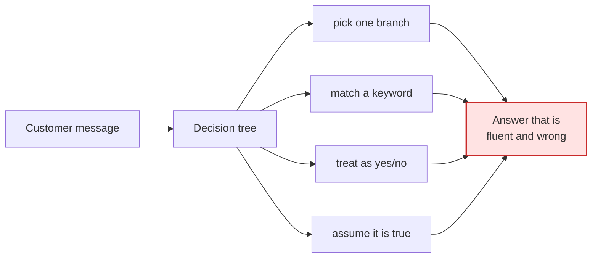

# 02 · Why a scripted bot fails here

The widget looks like a chat bubble, so people assume the work behind it is
writing answers and wiring them to buttons. That assumption is the reason most
of these projects produce something the client quietly switches off after two
months.

Below are four classes of message from the real flow, anonymized. Each one breaks
a decision tree, and each breaks it in a different place.

---

## Class 1 · Two questions in one sentence, one of them implied

> *"Do you have something for a 15-inch laptop and a lunch box, for my son, he
> walks to school in winter."*

A decision tree must pick one branch. Whichever it picks, it discards the rest of
the sentence.

There are four constraints here and only two are stated as questions. "For my
son" narrows the line. "Walks to school in winter" is a durability and weather
requirement that the customer does not know is a requirement — to them it is
context, and they would be surprised to learn it changed the answer.

**What breaks:** branch selection. The tree is structurally single-path and the
message is not.

**What is required instead:** extracting a *set* of constraints from a sentence,
then finding what satisfies all of them — and saying which constraint forced the
recommendation, so the customer can correct the one you guessed.

---

## Class 2 · The question is not in catalogue vocabulary

> *"Will this survive a teenager?"*

There is no field for this. No keyword matches. A retrieval system scoring
keyword overlap returns nothing, and a scripted bot falls through to "I did not
understand, please rephrase" — which the customer correctly reads as *this thing
cannot help me.*

The question is entirely answerable. It maps onto stitching, fabric weight, the
warranty terms and the specific failure modes that come back most often. But that
mapping is knowledge about the products, not a synonym list.

**What breaks:** the assumption that customer vocabulary and catalogue vocabulary
overlap. They do not, and the gap is widest exactly where the customer is least
expert — which is when they need the help.

**What is required instead:** a layer between the message and the facts that
reasons about *what would have to be true* for this to be a good answer.

---

## Class 3 · The answer depends on a condition the customer has not mentioned

> *"The zipper broke. Is it covered?"*

Coverage depends on the product line, the age, the failure mode and whether the
damage is wear or misuse. The customer has supplied one of four inputs and
believes they have asked a yes-or-no question.

A scripted bot has three options and all three are bad:

- **Answer yes.** Sometimes wrong, and a wrong yes creates a commitment the
  business has to honour or retract. Retracting is worse than never having said
  it.
- **Answer no.** Sometimes wrong, and a wrong no is an unrecorded lost customer.
- **Ask all four questions.** Correct, and reads like a form. Most people
  abandon at question two.

**What breaks:** the yes/no framing itself. The system must know that the
question is *underdetermined* before it decides what to do about it.

**What is required instead:** an explicit sufficiency check — do I have what this
answer requires? — that runs before generation, and a rule for what to do when
the answer is no. In this system that rule is per-principle, not global: each
principle card carries its own `uncertainty_rule`.

---

## Class 4 · The customer's premise is wrong

> *"I want to replace the wheels on model X."*

Model X has no wheels. The customer is thinking of a different product, or a
different brand, or a model from before a redesign.

A scripted bot pattern-matches "replace wheels" and returns the parts page,
confirming a false premise and sending the customer down a path that ends in a
phone call — the exact call the widget existed to prevent, now with added
frustration.

**What breaks:** the assumption that the message is true. Retrieval and matching
both treat the input as a valid query. It is a claim, and claims can be false.

**What is required instead:** a check against known facts *before* answering, and
a way to correct the premise without telling the customer they are wrong. That is
a reasoning step and a tone requirement at the same time.

---

## What the four have in common

Every failure produces an answer that *reads fine*. That is what makes the
scripted approach dangerous rather than merely limited: it does not fail loudly.
The customer receives a confident, well-formed, incorrect reply, and the business
finds out weeks later, if at all.

The architecture in the next document exists to make the system fail **visibly
and early** instead — by checking sufficiency before generating, by carrying an
explicit uncertainty rule per principle, and by treating "I need to check" as a
first-class outcome rather than a fallback.

---

## The one-line version

> A scripted bot answers the question it recognized.
> A reasoning system answers the question that was asked — or says it cannot.

---

**Next:** [03 · The reasoning stack](03-reasoning-stack.md)
