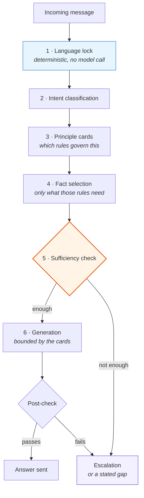

# 03 · The reasoning stack

Six layers between an incoming message and a sent answer. Each one can stop the
sequence, and stopping is a designed outcome rather than a failure.

The ordering is deliberate: **the cheapest and most deterministic checks run
first.** By the time a model is involved, the language is fixed, the intent is
known, and the set of admissible facts has already been narrowed.



---

## Layer 1 · Language lock

Runs first, **with no model call at all.** Scoring is arithmetic over the raw
text.

```python
def resolve(message: str, session_language: str) -> str:
    """The language THIS answer must be written in.

    A clear signal wins over the session — a client writing French is asking
    for French. An unclear message keeps the session, which is what stops the
    language from flapping on "oui" or "ok".
    """
    current = session_language or FR
    clear = detect(message)
    return clear or current
```

Three design decisions are visible in eight lines.

**Accents count double.** They are decisive and cheap — a single accented
character is stronger evidence than several ambiguous words.

**Accent-less Québec French is scored explicitly.** Real customers write `sac a
dos`, `boite a lunch`, `garantie a vie`. A detector built on accents alone reads
these as English and answers in the wrong language. The phrase list exists
because the failure was observed, not because it was anticipated.

**Ambiguous input keeps the session language.** A message with no clear signal —
`ok`, `merci`, a bare model number — does not get to change anything. Without
this rule the language flaps mid-conversation, which is the single most
machine-like thing a bilingual agent can do.

**Why deterministic.** Language is checkable, cheap and high-frequency. Spending
a model call on it would add latency to every turn and introduce variance into
something that has a right answer. This is the same principle as
[Part I · Gates](../part1/05-gates.md): put the decision in code where code can
decide it.

---

## Layer 2 · Intent classification

Maps the message onto a small set of intents and tags. This is where the "two
questions in one sentence" case from
[02](02-why-scripts-fail.md) stops being a branch selection problem: the output
is a set, not a choice.

The tags produced here are what layer 4 uses to pull in facts that no principle
explicitly requested but that the topic clearly touches.

---

## Layer 3 · Principle cards — the part that makes it think

This is the core structure. Twenty-five cards, each one a small governed rule
with twelve fields:

```jsonc
{
  "id": "…",
  "title": "…",
  "source": "where this rule came from",
  "approval_status": "approved | draft",
  "channel_scope": "widget | messaging | both",
  "triggers": ["what activates this card"],
  "known_facts": ["fact ids this rule depends on"],
  "allowed_action": "what may be done under this rule",
  "forbidden_action": "what may never be done under it",
  "uncertainty_rule": "what to do when the inputs are insufficient",
  "next_step_class": "what kind of move comes next",
  "exceptions": ["where this rule does not hold"]
}
```

Four of those fields are the difference between a rule set and a reasoning
structure.

**`forbidden_action`.** Stating what is permitted is not enough — a model given
only permissions will find adjacent behaviour that was never considered.
Prohibitions are carried explicitly, per rule, next to the permission.

**`uncertainty_rule`.** *Per card, not global.* What to do with insufficient
information is different for a warranty question than for a stock question:
one must not guess at all, the other may offer a qualified answer. A single
global confidence threshold cannot express that, which is why systems that use
one end up either over-cautious everywhere or over-confident everywhere.

**`exceptions`.** Where the rule does not hold. A rule without stated limits has
not been thought through, and the limits are where the failures live.

**`approval_status` and `channel_scope`.** A card is not live because someone
wrote it. It is live because it was approved, and it applies to the channels it
was scoped to. See [04 · Product knowledge](04-product-knowledge.md) for where
that filter is enforced.

---

## Layer 4 · Fact selection

Twenty-seven facts exist. A given answer sees a handful.

```python
def select_facts(cards: list, intent: dict) -> list:
    """Only the facts the selected principles actually need, plus tag matches."""
    wanted = {fid for c in cards for fid in c.get("known_facts", [])}
    by_id = {f["id"]: f for f in facts()}
    out = [by_id[fid] for fid in sorted(wanted) if fid in by_id]
    have = {f["id"] for f in out}
    for f in facts():
        if f["id"] not in have and set(f.get("tags", [])) & set(intent["tags"]):
            out.append(f)
    return out
```

Two passes: the facts the active principles declared they need, then facts whose
tags match the intent even though no principle asked for them.

**Why not send everything.** Twenty-seven facts is small enough that dumping all
of them would fit. It is still wrong. Irrelevant material does not sit inertly in
a prompt — it dilutes the relevant material and gives the model permission to
reach for something that does not apply. Selection is a quality mechanism that
happens to also be cheaper.

This is [Part I · The context economy](../part1/02-context-economy.md) applied
one level down: the same argument that governs what loads into a session governs
what loads into a single answer.

---

## Layer 5 · Sufficiency check

The layer that separates this from a retrieval-and-generate pipeline.

Before anything is generated, the system asks whether the selected facts actually
satisfy what the active principles require. If they do not, generation does not
run. The `uncertainty_rule` of the governing card decides what happens instead:
ask one targeted question, give a qualified partial answer, or hand over.

**Why before and not after.** A model asked to generate an answer and then judge
its own confidence will produce a fluent answer and a confident score, because
both come from the same process. Checking inputs before generation is a different
question asked of different material, and it is the only version that can come
back negative.

---

## Layer 6 · Generation, bounded

The model writes the answer. What it is allowed to write is already constrained
by the cards: the permitted action, the prohibitions, the tone, the facts it may
cite, and the class of next step it may propose.

The system prompt is not where the rules live. It is where the *voice* lives.
Rules live in the cards, and the cards are data — reviewable, diffable, approved
individually, and scoped per channel. A rule that lives in a prompt cannot be any
of those things.

---

## Post-check and the rule that produced it

After generation there is a verification pass before the answer is sent. Its
existence is the direct result of a rule the project learned the hard way, and
which is now written into the critic's own instructions:

> Never propose fixing behaviour by adding words to a prompt. On this project
> that has been rolled back three times; a control must be code, a flag or a
> test.

Three rollbacks. Each time, the fix that felt fastest — add a sentence to the
prompt telling it not to do that — held until the next unusual message and then
failed silently. What worked was moving the constraint into a place that does not
depend on the model's cooperation.

That sentence is the same one that governs Part I. It was learned here.

---

**Next:** [04 · Product knowledge](04-product-knowledge.md) — where the facts
come from and why the review filter lives in SQL.
