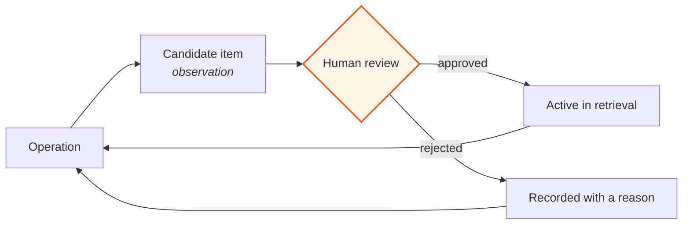

# 05 · Memory that stays oriented

The catalogue changes. Products are discontinued, colours are dropped,
specifications are corrected, the website is edited by someone who does not know
an agent is reading it.

An agent whose knowledge is a snapshot is correct on the day it ships and
degrades from then on, invisibly, because a stale answer looks exactly like a
fresh one. This document is about how the knowledge updates itself and how the
agent stays correct while it does.

---

## Three states, not two

The naive model is *present* or *absent*. Reality has a third state that carries
most of the risk.

| State | Meaning | Agent behaviour |
|---|---|---|
| **Active** | Seen in the latest sync, confirmed | Answer normally |
| **Stale** | Not seen recently, not confirmed gone | Answer with the gap stated, or check |
| **Absent** | Confirmed removed | Do not offer it |

The middle state is the whole design. Collapsing it into "absent" makes the agent
deny products that exist. Collapsing it into "active" makes it sell products that
do not. Neither error is recoverable at answer time, so the distinction has to
survive all the way from the sync into the reasoning layer.

---

## The rule that prevents a catalogue full of false deaths

```python
def reconcile(seen: set, errors=(), now: float = None, verify=None) -> dict:
    """Record which stored rows the crawl did NOT see. Never deletes anything.

    A sync that hit ANY error reconciles NOTHING. Half a crawl reporting "these
    19 products are gone" is how a fetch failure becomes a catalogue full of
    false deaths, and `sync_now` already returns ok on a partial crawl: a page
    that parses to {} is dropped without recording an error, so `errors`
    understates the damage rather than overstating it.
    """
```

Three separate protections in one function.

**Never deletes anything.** Absence from a crawl is evidence, not proof. Rows are
marked, never removed, so a wrong conclusion is reversible and visible.

**Any error means no reconciliation at all.** Not "reconcile the parts that
worked." A partial crawl that reports nineteen products missing is
indistinguishable from nineteen products actually being discontinued, and acting
on it corrupts the catalogue in a way that takes weeks to notice.

**The error signal is assumed to understate the damage.** The comment is explicit
that a page parsing to empty is dropped without recording an error. So the
threshold is not "few errors, proceed" — it is *any* error, stop. Designing
against a signal you know is optimistic is the difference between a check and a
formality.

---

## How the agent stays oriented while the base moves

Four mechanisms, each closing a different gap.

**Review status is data, not convention.** Every page and memory item carries an
explicit approval state, and the retrieval query filters on it — see
[04 · Product knowledge](04-product-knowledge.md). New knowledge is inert until
approved. There is no window in which an unreviewed page is live because
someone forgot a step.

**Recency participates in ranking.** Retrieval sorts by relevance then by update
time. Between two comparably relevant pages, the more recently confirmed one
wins. This does not solve staleness; it stops the oldest version of a fact from
winning by keyword luck.

**Types are separated so contradictions surface.** Curated knowledge and
operationally learned items live in different stores with different review
disciplines. When a learned item contradicts a curated page, the conflict is
visible as a conflict instead of resolving silently in favour of whichever was
retrieved first.

**Superseding is explicit.** When a fact is corrected, both versions are kept,
the older is marked superseded, and the reason the newer won is recorded. This
costs a paragraph and buys the ability to reverse the change later — which
matters, because roughly one correction in ten is itself wrong.

---

## The self-improvement loop, and its hard limit

Operation produces material: cases that went badly, patterns that recur,
corrections a human made to an answer. That material is candidate knowledge.



**The review step is not automatable here, and I did not automate it.**

An agent that writes its own durable knowledge without review is not a more
mature system. It is a system with a quieter failure mode: a wrong item enters,
gets retrieved, shapes answers, and reinforces itself because the answers it
shaped look consistent. By the time it is noticed the base contains several
generations of confident error and there is no clean point to roll back to.

At this scale review costs minutes a week. The cost of not having it is
unbounded, and it is not detectable early. That trade is not close.

**Items are typed rather than filtered.** An unconfirmed observation is not
discarded — discarding hypotheses means rediscovering them. It is stored as an
observation and is not permitted to be presented as a fact. The distinction lives
in the data model, so it cannot erode.

---

## What made these rules exist

One episode is worth stating plainly, because it is the most useful thing in this
document.

The reconciliation logic originally lived inline inside the sync function. The
only way to test it was to re-implement the same logic inside the test. **A
blind adversarial critic — a reviewer given the diff but not the project's
decision history — pointed out that the test stayed green when the real
threshold was changed.** The test was exercising a copy. It proved nothing about
the code that runs.

The fix was structural: extract the logic into a separately callable function so
the test exercises the original.

Two things follow, and both are now standing practice.

**A test that exercises a re-implementation is worse than no test**, because it
reports confidence it has not earned.

**The critic has to be blind.** A reviewer holding the project's decision
registry rationalizes: it assumes an odd choice was deliberate. One that does not
have it asks why, and the times it is wrong are cheap. The critic's own
instructions carry the corresponding caution — *if something looks wrong but
could be a deliberate owner decision, say so explicitly instead of asserting.*

---

**Next:** [06 · Limits and handoff](06-limits-and-handoff.md)
